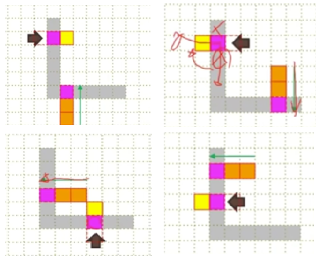
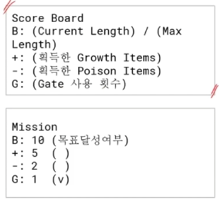

## 구성 요소

**wall** - snake head와 접촉시 game over

**gate** - 두 개가 한 쌍, 겹치지 않음 gate에 진입 시 다른 gate로 진출

**immune wall** - gate로 바뀌지 않는 wall

**growth item** - snake head와 접촉 시 snake length +1

**poison item** - snake head와 접촉 시 snake length -1

---

## 규칙

### #1

- snake는 진행방향의 반대방향으로 이동할 수 없다.
    - 진행 방향과 반대 방향인 키를 입력 시 game over
    - 진행 방향과 같은 방향인 키를 입력 시 무시
- snake는 자신의 Body를 통과할 수 없다.
- snake는 벽을 통과할 수 없다.
- head의 방향 이동은 일정 시간에 의해 이동한다.
- snake는 방향 변경 시 몸이 굴곡되며 이동한다.

### #2

- snake의 이동 방향에 item이 놓여 있는 경우
    - snake가 item을 획득한다.
    - growth item의 경우 snake length가 1 증가한다.
        - 진행 방향 쪽으로 증가한다.
    - poison item의 경우 snake length가 1 감소한다.
        - snake length가 3 미만이면 game over
        - tail 부분이 감소한다.
- item의 출현
    - 벽과 snake body가 있지 않은 임의의 위치에 출현
    - 출현 후 일정 시간이 지나면 사라지고 다른 위치에 출현
    - 동시에 출현 가능한 item은 최대 3개

### #3

- Gate는 두 개가 한 쌍이다.
- Gate는 겹치지 않는다.
- Gate는 임의의 위치에 있는 벽에서 나타난다.
- Gate에 Snake가 진입하면 다른 Gate로 진출한다.
- Gate에 Snake가 진입중인 경우
    - Gate는 사라지지 않는다
    - 다른 위치에서 Gate가 나타나지 않는다.
- Gate는 한번에 한쌍만 나타난다.

### #4

- Gate가 나타나는 벽이 가장자리일 경우
    - 항상 Map의 안쪽 방향으로 진출한다.
- Gate가 나타나는 벽이 Map의 가운데 있을 때
    - 1.진입 방향과 일치하는 방향
    - 2.진입 방향의 시계방향
    - 3.진입 방향의 반시계방향
    - 4.진입 방향의 반대 방향
    - 숫자는 우선 순위.
    - 예시: ⇒ 는 진출 방향 / →는 진입 방향
        
        

### #5

- Wall
    - Gate로 변할 수 있다.
- Immune Wall
    - Gate로 변할 수 없다.
- 모든 Wall
    - snake가 통과할 수 없다.
    - snake head와 충돌 시 game over
- Gate의 출현 방법 결정
    - 예시 1: 게임 시작 후 일정 시간 이후
    - 예시 2: 몸의 최대 길이 10을 초과하면

### #6

- 점수 계산
    - 게임 중 몸의 최대 길이 계산
        - B: (현재 길이)/(최대길이)
    - 게임 중 획득한 Growth Item의 수
    - 게임 중 획득한 Poison Item의 수
    - 게임 중 사용한 Gate의 수
    - 게임 시간(Seconds로 계산)
- 게임 방법
    - 주어진 미션 달성하기
- 미션
    - 각 점수 항목별로 목표치 도달시 게임 종료
    - 예시 : 목표 달성 여부를 v로 표시한다.
        

## 과제 마일스톤  5단계

1. **2차원 배열 snake map을 Game화면으로 표시하는 프로그램 최소 크기는 21x21**
    1. wall에는 gate가 생성 가능하지만 immune wall에는 gate가 생성 안됨.
    2. 모서리와 같이 snake가 gate로 들어갈 수 없거나 출구로써 나왔을 때
       바로 wall과 마주치는 부분은 immune wall 처리가 필요
2. **snake를 map에 표시하고 화살표 입력에 따라 snake가 움직이는 프로그램** 
    1. 일정 틱 (0.5초) 간격으로 snake의 위치 이동이 필요
    2. snake가 정지해있는 틱 (0.5초) 사이에 입력된 키에 따라 snake 진행방향 결정
    3. 규칙 1 준수
3. **growth item, poison item 출현**
    1. item의 수명 결정
    2. item은 wall과 snake를 제외한 모든 공간에서 출현 가능 → 난수를 이용해서 출현 위치 결정
    3. 동시 출현할 수 있는 아이템 갯수 3개로 제한
    4. 규칙 2 준수
4. **gate 출현**
    1. gate는 wall에서 무작위로 2개 결정 → 난수를 이용
    2. gate의 출현 조건(게임 시작 이후 10초 경과 시)
    3. 규칙 3, 4, 5
5. **점수 및 미션, stage**
    1. stage clear 조건 설정
    2. stage clear시 다음 stage로, stage는 최소 4개, map의 중복은 x
    3. 규칙 6 준수