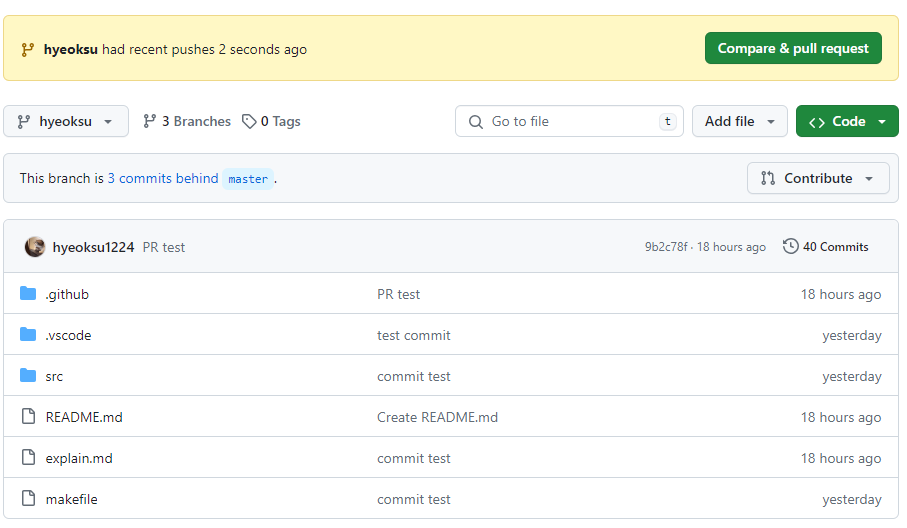
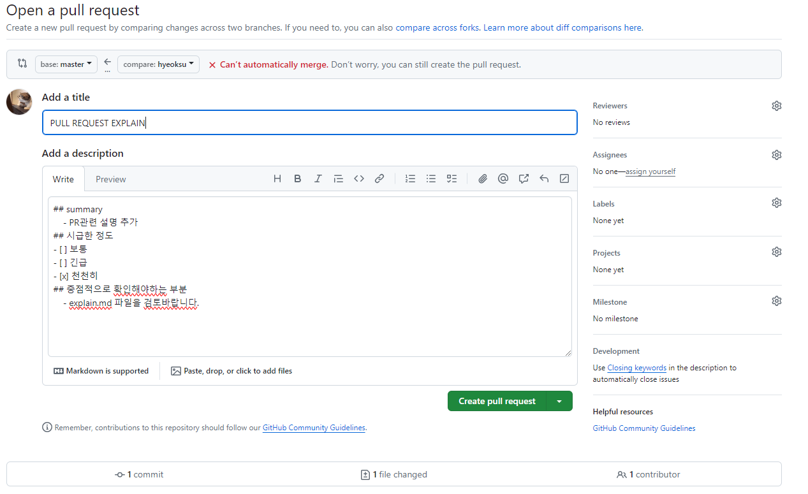
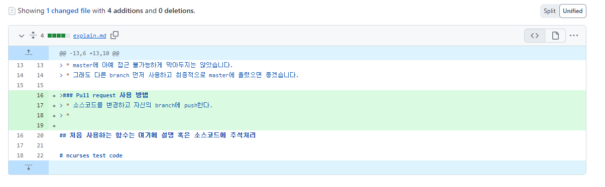
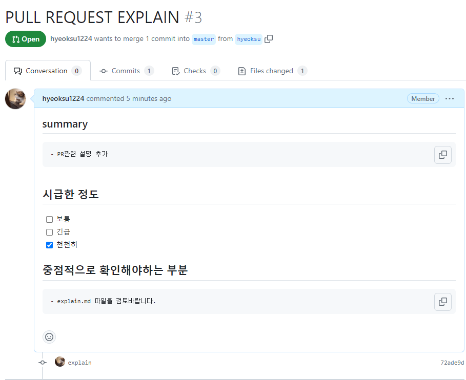
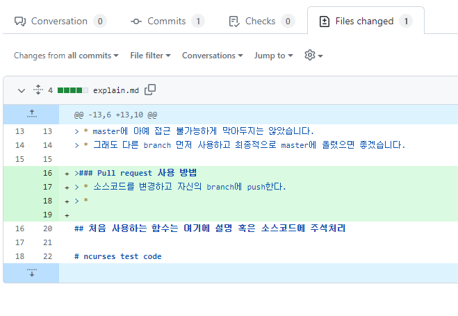
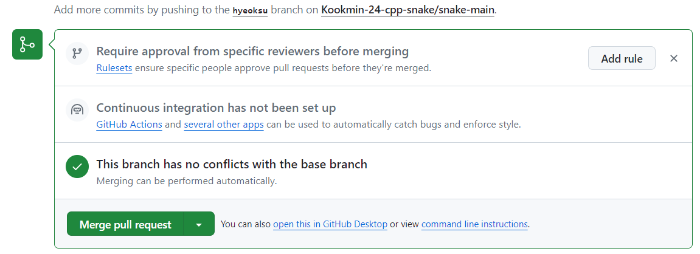

# Team Project 메뉴얼
> ### 초기 설정
> * cmd를 실행한다.
> * git clone https://github.com/Kookmin-24-cpp-snake/snake-main.git projectname
> * projectname이라는 이름의 프로젝트에 master branch의 코드의 복사본을 로컬 저장소로 저장한다.
> * (이하 내용은 optional. 만약 이미 작업을 수행하는 branch가 있다면 git checkout branchname으로 생략가능)
> * github의 snake-main에 들어간 뒤 projects에 들어가보면 snake game milestone을 찾을 수 있다.
> * snake game milestone의 진행 중 보드에서 자신이 수행할 작업을 클릭한다.
> * 현재 issue인 작업이 아니라면 convert to issue를 클릭해준다.
> * 우측에 development라는 메뉴 아래에 파란색 글씨로 Create a branch라 되어 있는 곳을 클릭한다.
> * Branch name을 수정해주고 branch source는 develop으로 선택, checkout locally를 선택하고 branch를 만든다.
> * local clone에 다음의 두 명령어를 입력한다
> * git fetch origin
> * git checkout branchname
> * 개발 시작!

# snake-main의 폴더 설명
> ### src
> * source code를 모아둔 폴더.

> ### makefile
> * 각 소스 파일을 컴파일해서 Object 파일을 생성하고 실행파일 app.out을 생성
>   - prototype은 작성 완료. -lcurses 이전에 src/파일명.cpp를 작성해 소스코드 추가
> * make만 입력하는 것으로 프로그램이 동작하도록 도와준다.

>### .github/PULL_REQUEST_TEMPLET.md
> * 변경 사항 발생 시 PULL을 요청하고 어떤 것이 변경되었는지 명시
> * 작성 요령은 PULL_REQUEST_TEMPLET.md 참고
> * master에 아예 접근 불가능하게 막아두지는 않았습니다.
> * 그래도 다른 branch 먼저 사용하고 최종적으로 master에 올렸으면 좋겠습니다.

>### Pull request 사용 방법
> * 소스코드를 변경하고 작업하는 branch에 push한다.
> 
> * 그러면 위와 같이 compare & pull request라는게 나온다. 클릭해준다.
> 
> * 이런 창이 뜨는데 여기에 PULL_REQUEST_TEMPLETE.md에 있는 템플릿을 이용해 PR을 작성한다.
> * 주의 : base와 compare 부분을 확인해줘야 한다.
>   - develop <- working branch, master <- develop 순으로 merge하는 것을 원칙으로 한다.
> 
> * 스크롤을 내려주면 코드 변경점도 같이 볼 수 있다.
> * 다 작성한 뒤 Create pull request를 클릭해준다.

----

> * PR을 작성하지 않은 다른 사람이 pull request를 확인한다.
> * snake-main이라는 repo에 들어가보면 좌상단에 pull request가 있다.
> 
> * 작성된 PR을 확인한다.
> 
> * files changed 메뉴를 클릭하면 코드의 어떤 점이 변경되었는지 알 수 있다.
> 
> * 코드에 충돌이 발생하지 않는다면 위와 같은 모습일 것이다. Merge pull request를 누르고 confirm merge를 누른다.
> * 짠 작업중인 branch과 develop이 동기화된다 혹은 develop과 master가 동기화된다
> * 맨 아래에 있는 Close pull request를 이용해 PR을 반려한다.

### PR 중 충돌(conflict) 발생 시 해결 방법
> * commandline에서 수행
> * git checkout develop
> * git pull origin develop
> * git checkout feacherA(사용하고 있던 branch)
> * git merge develop
> * 그러면 충돌이 발생한 곳이 표시됨.
> * 팀원과 의논하여 병합할 방법을 선택한다.
> * git add .
> * git commit "commitname"
> * git push origin feacherA
> * 이 후 다시 Merge pull request 시도

## git 명령어 모음
> * git checkout hyeoksu(or stopkite or master)
>   - commit하는 branch를 선택합니다.

> * git checkout -b branchname
>   - branchname이라는 branch를 생성합니다.

> *  git push --set-upstream origin branchname
>   - 터미널에서 만든 branch를 push해줍니다. 이걸 해야 branch가 적용 완료됩니다.

> * git pull origin branchname (master, hyeoksu, stopkite.. 이 중 하나를 입력)
>   - branchname의 변경사항을 pull해줍니다.

> * git add .
>   - 프로젝트 안에 있는 변경사항을 모두 스테이징 해줍니다. 이걸 해야 commit을 할 수 있습니다.

> * git commit "commit name"
>   - add해준 변경사항들을 commit해줍니다.

> * git push origin branchname
>   - branchname에 commit을 push해줍니다. master가 아닌 branch에 우선적으로 입력하길 권장합니다.

> * git clone https://github.com/Kookmin-24-cpp-snake/snake-main.git
>   - 터미널을 열고 clone할 저장소 폴더로 이동합니다 (cd 명령어 사용)
>   - 위 명령어를 입력합니다.
>   - push pull 잘못하다가 꼬이면 그냥 기존 로컬 저장소 지우고 clone 해오는게 정신건강에 편합니다...

## 처음 사용하는 함수는 여기에 설명 혹은 소스코드에 주석처리

<code> #include &lt; ncurses.h &gt; </code>

ncurses 라이브러리를 사용하는 C/C++ 프로그램들의  컴파일을 위해 <ncurses.h> 헤더파일을 포함하여야 한다.

<code>WINDOW initscr(void); </code>

initscr() 함수를  반드시 먼저 호출하여 터미널을 초기화하여야 한다. initscr() 함수는 'stdscr' 이라 일컫는 기본 윈도우를 생성한다.

<code>int printw(const char *fmt, ...); </code>

stdscr 인 기본 윈도우 내에 (y, x) 위치에 문자열을 출력한다. 프로그램에서는 커서 위치가 0, 0 이기 때문에 현재 윈도우의 좌상단에 문자열을 출력한다.

<code>int move(int y, int x);</code>

해당 좌표에 커서를 넘겨준다. 첫 번째 인자에는 y좌표, 두 번째 인자에는 x좌표를 파라미터로 가진다.

<code>refresh();</code>

실제로 printw 함수를 실행한다고 바로 화면에 문자열이 출력되는 것이 아니다.
함수 printw 는 기본 윈도우에 문자열을 쓰고, 화면에 출력은 하지 않는다. 즉 윈도우 버퍼에 데이터를 쓰기만 함을 의미한다.
윈도우의 버퍼의 내용을 화면에 출력하기 위해서는 refresh() 함수를 호출여야 한다.

<code>endwin();</code>

최종 ncurses 모드를 종료하여야 한다.  이를 생략하면 프로그램 종료 후 터미널이 비정상적으로 동작할 수 있다.
함수 endwin() 는 ncurses 에 의해 점유되었던 메모리의 해제 후, 터미널을 일반 모드로 변경한다.

<code>int start_color(void);</code>

ncurses에 color attribute 사용 선언

<code>int init_pair(short pair, short f, short b);</code>

색 attribute를 설정한다. 한쌍의 색 속성을 설정
인자 (숫자, 폰트색, 폰트배경색)
ex) init_pair(1, COLOR_RED, COLOR_WHITE);
1번 팔레트
폰트 색상 : 빨간색, 폰트 배경 색상 : 흰색
반환값 : 성공 시 0, 실패 시 -1

<code>int attron(int attrs);</code>

적용할 속성 설정
ex) attron(COLOR_PAIR(1))
1번 팔레트 사용
반환값
성공 시 0, 실패 시 -1

<code>int attroff(int attrs);</code>

attribute의 해제
printw 함수 출력전 속성을 키고 끄는 함수이다. 인자로 COLOR_PAIR을 넣어주면 앞에 초기화 해주었던 pair의 속성이 활성화 된다

<code>box(WINDOW,vertical,horizontal)</code>

윈도우의 테두리를 생성한다.

<code>wbkgd(WINDOW, COLOR_PAIR)</code>

윈도우의 백그라운드컬러를 조정한다.

<code>subwin(WINDOW,int,int,int,int)</code>

서브 WINDOW를 좌표에 맞게 생성한다.

<code>delwin(WINDOW)</code>

생성한 서브 WINDOW를 삭제한다.

# 제가 md파일이랑 html을 처음 만져봐서 많이 안이쁘네요.
# 가독성도 많이 떨어져보이긴 한데 제가 영 센스가 없어서...
# 하면서 이거 봐도 이해 안되는 부분 있으면 언제든 얘기해주세요
# 답은 못해드려도 고민은 같이 해볼게요...
